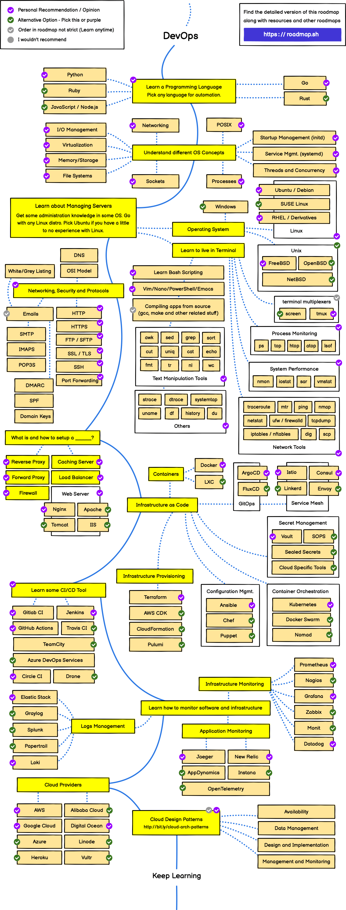

### Jenkins:

Jenkins is an open-source automation tool written in Java with plugins built for Continuous Integration and Continuous deployment/delivery purposes.

### Why Jenkins:

jenkins is used to build and test your software projects continuously make it easier for developers to integrate changes to the project, and make it easier for users to obtain a fresh build. It provides many plugins that help to support building, deploying and automating any project.

### Continuous Integration:

Continuous Integration is a software development practice `where code is continuously tested after a commit to ensure there are no bugs`. The common practice is that whenever a code commit occurs, a build should be triggered.

### Continuous Deployment

Continuous Deployment is a software development process where code changes to an` application are released automatically into the production environment.`

### Continuous Delivery

Continuous delivery is a software development practice where a code change is built, tested, and then` pushed to a non-production` testing or staging environment but final deploy to production is made after approval.

### Advantages of Jenkins
 * Open source tool
 * Easy to install
 * Platform Independent
 * Support 1000+ plugins
 * Free of cost
 * Automates integration
  
### Webhook

Webhook in jenkins triggers pipeline automatically when any changes are done in github repo like commit and push.

 * Copy jenkins URL
 * Go to repo settings in github
 * Select Add webhook and paste URL
 * Append url with /github-webhook/
  
### Monitoring in Jenkins

* Install any monitoring plugins like Prometheus, grafana, datadog ...
* SSH into prometheus server
* Edit vi /etc/prometheus/prometheus.yml file
* Add jenkins target - ip:8080
* Restart prometheus
* Hit endpoints and see data scrape by prometheus
### Backup in Jenkins
* Install Thin Backup plugin
* Create directory jenkinsbackupand cd into it.
* Set write permission to directory
* Go to jenkins enter dir path and backup and restore jenkins.
  
### CI/CD Workflow:
-------------------

## ⚙ DevOps Tools for Each Phase of the DevOps Life Cycle ♾

🔢. Continuous Development (CD)
Jira: Agile project management tool aiding project management, workflows, and bug tracking.
Git: Open-source version control system facilitating collaboration and nonlinear workflows. GitHub extends its collaborative features.

🔢. Continuous Integration (CI) and Continuous Delivery (CD)
Jenkins: Java-based, open-source tool supporting CI and CD with customizable workflows, easy installation, and numerous plugins.

🔢. Continuous Testing
Selenium: Open-source automated testing framework supporting web app automation across multiple browsers and OS.
Bamboo: Server-based tool tightly integrated with Jira, excelling in complex build plans and parallel testing.

🔢. Continuous Deployment
Docker (container management): Packages and executes distributed apps, encouraging collaboration via Docker Hub.
Ansible (configuration management): Automates configuration management and infrastructure orchestration.

🔢. Continuous Feedback
Jira Service Management: Centralizes feedback from diverse sources for improved communication.
Parlor: Engages with users to collect real-time contextual insights, integrating with various business tools.

🔢. Continuous Monitoring
Prometheus: Open-source performance monitoring database enabling robust reporting and visualization.

🔢. Continuous Operation
Opsgenie: Manages incidents, predicts and resolves service disruptions, integrates with various monitoring and communication tools, ensuring appropriate notifications and automated escalations for critical issues.

